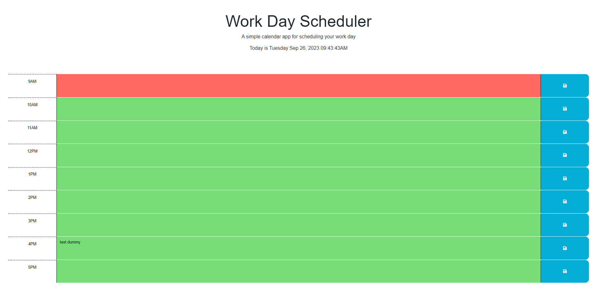

# Work Day Planner

## Description

The purpose of this project is to learn to build a dynamically functioning single day, work planner. By using JavaScript, HTML, CSS, and third-party APIs such as JQuery, Bootstrap, and DayJS, this application displays a keen understanding of how to create an application that displays the current date/time, add items to the local storage, display items that persist from the local storage, and dynamically update an application without users having to manually refresh the page. The application features a save button that allows users to save their items to the correct time block with events that persist until the user clears the application data. The motivation fr this project was to practice utilizing Javascript and third party APIs to become proficient in using local storage, dynamic date/time, and user functionality. This project solves the issue of learning how to use third party APIs as tools to create applications that are simply styled and responsive.

##Installation

N/A

## Usage

To use the application, users will note the current date and time displayed at the top. Users may type events that they wish to plan within the text area of the time block. By clicking save the save button, the application will save the user's input to that specific time block in which it was scheduled. The time blocks are color coordinated for user friendliness, indicating if the time block is past, current, or future via color coding with grey, red, and green respectively. Although users may refresh and exit the application, the stored events will persist as long as they are stored in the local storage and will display automatically each time a user returns to the application. To clear the work day calendar, users will have to clear the browsing data of their current browser or enter the command CTRL + SHIFT + Delete.

## Credits

Bootstrap for their utility API that was used to design easy-to-use features and layouts. JQuery API for simple creator syntax in JavaScript. DayJS API for integrated date/time utility and functionality. TA Megan Meyers for assistance in using DayJS to dynamically update the displayed time and functionality, and for assistance in efficiency for time-block color coding.

## Link

## Image(s)

